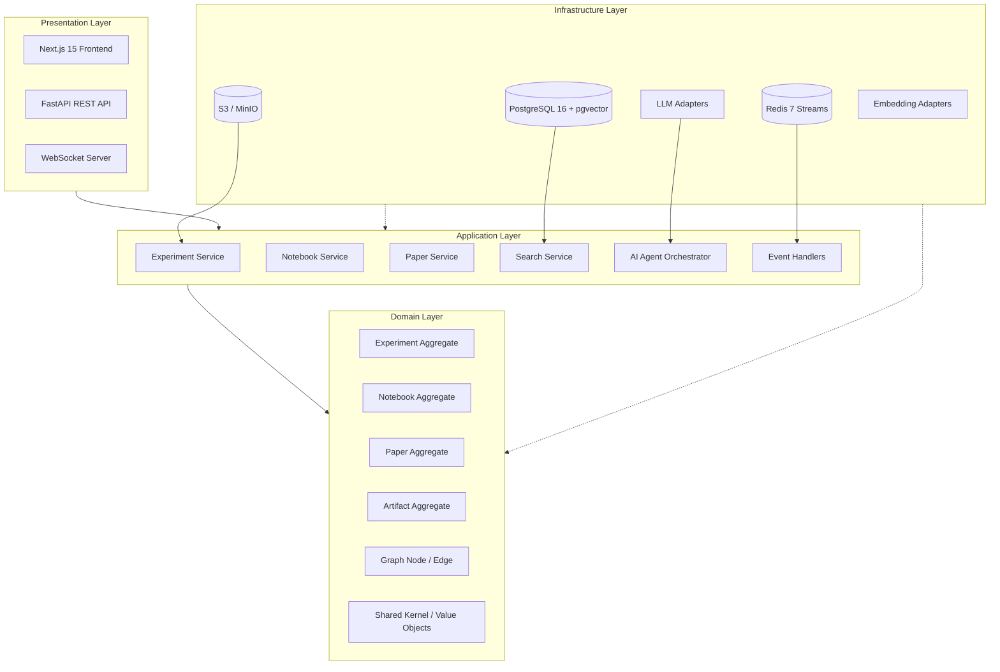
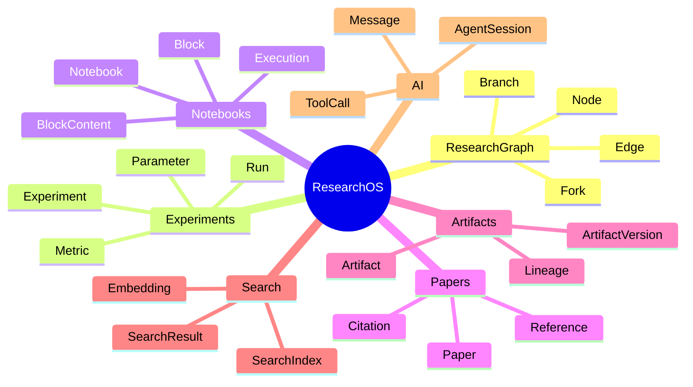
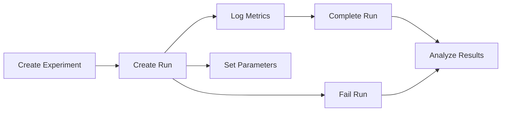
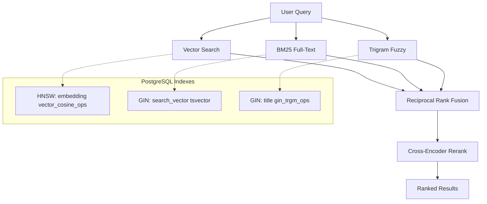
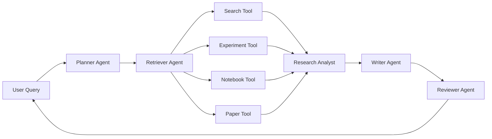
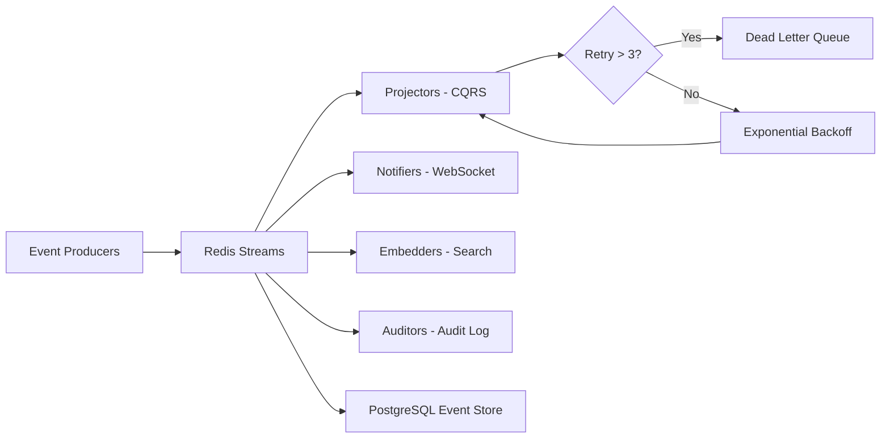
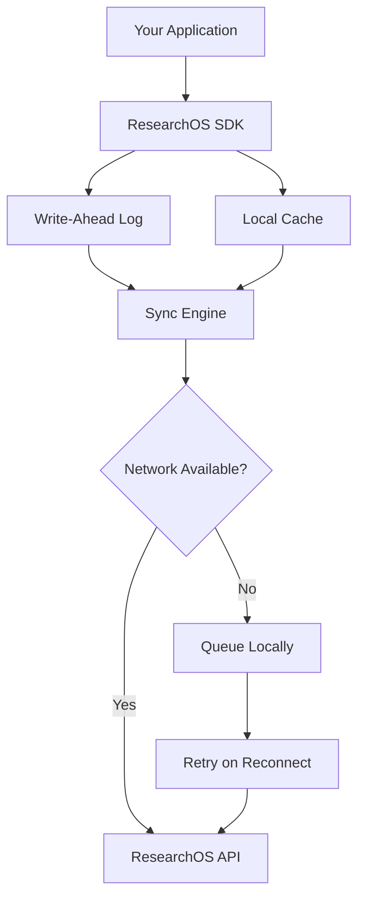
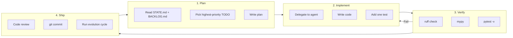

# ResearchOS — Research Operating System

A unified, open-source platform for the full AI/ML research lifecycle — experiment tracking, block-based notebooks, paper composition, hybrid semantic search, multi-agent AI assistance, and offline-first SDK — built with Domain-Driven Design and Hexagonal Architecture.

---

## Table of Contents

1. [Overview](#overview)
2. [Architecture](#architecture)
3. [Tech Stack](#tech-stack)
4. [Features](#features)
5. [Quick Start](#quick-start)
6. [API Reference](#api-reference)
7. [Project Structure](#project-structure)
8. [Design Decisions](#design-decisions)
9. [Testing](#testing)
10. [Roadmap](#roadmap)
11. [Documentation](#documentation)
12. [Contributing](#contributing)

---

## Overview

ResearchOS replaces the fragmented toolkit of today's researcher — separate tools for experiments, notes, papers, and collaboration — with a single integrated platform. Every research object (experiment, hypothesis, notebook, paper, dataset, model) is a first-class citizen in a property graph, connected by typed edges that capture the full provenance of your work.

```
                    +-------------------------------------------+
                    |         ResearchOS Platform                |
                    +-------------------------------------------+
                    |                                           |
                    |   Experiment    Notebook     Paper         |
                    |   Tracking      Authoring    Composition  |
                    |                                           |
                    |   Semantic      AI           Python SDK   |
                    |   Search        Assistant    (Offline)    |
                    |                                           |
                    +-------------------------------------------+
```

**Phase 1 is complete and production-ready** (July 2026). The foundation — authentication, multi-tenancy, experiment lifecycle, hybrid search, event system, notebook and paper domains, AI assistant — is built, tested, and deployed.

---

## Architecture

### Hexagonal (Ports & Adapters) with Domain-Driven Design

The system follows a strict layered architecture where the **domain layer imports nothing** from outer layers.



### Bounded Contexts



### Layer Dependency Rule

```
api  -->  application  -->  domain
infrastructure implements domain interfaces
domain imports NOTHING from outer layers
```

The domain layer contains only pure Python entities, value objects, events, and repository interfaces. It has zero dependencies on frameworks, databases, or external libraries.

---

## Tech Stack

| Layer | Technology | Purpose |
|-------|-----------|---------|
| **Backend Runtime** | Python 3.11+ · FastAPI · uvicorn | HTTP server and async dispatch |
| **Validation** | Pydantic v2 | Request/response schemas, domain models |
| **Database** | PostgreSQL 16 + pgvector | Primary store, vector search, full-text |
| **Cache & Streams** | Redis 7 | Session cache, event streams, pub/sub |
| **Object Storage** | S3-compatible (MinIO) | Artifact and file storage |
| **Auth** | PyJWT · bcrypt · python-jose | JWT tokens, password hashing, API keys |
| **Frontend** | Next.js 15 · React 18 · TypeScript | Web application |
| **UI** | Tailwind CSS · shadcn/ui · TipTap · Recharts | Components, editor, charts |
| **State** | Zustand | Frontend state management |
| **AI / LLM** | OpenAI · Anthropic · Ollama | Model inference, embeddings |
| **Embeddings** | text-embedding-3-small · Cohere | Vector embeddings for search |
| **Migrations** | Alembic | Database schema versioning |
| **Container** | Docker · Docker Compose | Development environment |
| **Orchestration** | Kubernetes · Helm | Production deployment |
| **Monitoring** | Prometheus · OpenTelemetry · Grafana | Metrics, tracing, dashboards |
| **SDK** | Python (httpx · pydantic) | Offline-first client library |

---

## Features

### Authentication and Multi-Tenancy

```
Login ---> JWT Access Token ---> Authenticated Request
                           |
                           v
                    Organization Isolation
                           |
                    +-----------v-----------+
                    |   Row-Level Security   |
                    |  (organization_id on   |
                    |   every table)         |
                    +------------------------+
```

- JWT authentication with access and refresh token rotation
- Organization-scoped data isolation via `organization_id` on every table
- PostgreSQL Row-Level Security (RLS) enforced at database level
- API key generation for SDK and programmatic access
- Role-based access control: owner, admin, member, viewer

### Experiment Tracking

Full lifecycle management for ML experiments with run-level granularity.



- **Experiment** — A named, parameterized research investigation
- **Run** — A single execution attempt with immutable parameter snapshot
- **Metric** — Time-series key-value data logged per step (accuracy, loss, F1, etc.)
- **Git Integration** — Commit SHA and branch tracked per run for reproducibility

### Hybrid Search

Three search strategies fused into a single ranked result set.



- **Vector** — pgvector HNSW indexes with cosine similarity for semantic search
- **BM25** — PostgreSQL `tsvector` full-text search with weighted ranking (title = A, description = B)
- **Fuzzy** — pg_trgm trigram matching for typo-tolerant autocomplete
- **Fusion** — Reciprocal Rank Fusion (RRF) combines all three result sets
- **Highlighting** — `ts_headline()` extracts relevant snippets from matched text
- **Suggestions** — Structured autocomplete returns node ID, title, type, and similarity score
- **Target latency**: p99 < 100ms

### Notebooks (Block-Based)

Not Jupyter. Each notebook is a sequence of independently versioned blocks.

```
  +--------------------------------------------------+
  | Notebook: "ResNet Ablation Study"                |
  | Branch: main  |  Commit: a1b2c3d                |
  +--------------------------------------------------+
  |                                                    |
  | [Block 1] MARKDOWN  v2                            |
  |   "# ResNet Ablation Study"                       |
  |   "This notebook compares ResNet depths..."       |
  |                                                    |
  | [Block 2] PYTHON    v5                            |
  |   "import torchvision.models as models"           |
  |   "model = models.resnet50(pretrained=True)"      |
  |                                                    |
  | [Block 3] MERMAID   v1                            |
  |   "graph TD; A[Input] --> B[Layer 1]; B --> C"    |
  |                                                    |
  | [Block 4] CITATION  v1  (ref: he2016deep)         |
  |   "He, K. et al. Deep residual learning..."       |
  +--------------------------------------------------+
```

- Block types: markdown, python, rust, sql, mermaid, latex, diagram, experiment_card, metric, citation, ai_summary
- Independent block versioning — only changed blocks create new versions
- Git-like branching and merging with conflict detection
- Reusable blocks — reference a block from another notebook; upstream edits propagate
- Execution engine with kernel pool (ipykernel), SQL executor, and Mermaid renderer
- Export to Jupyter `.ipynb`, LaTeX, and PDF formats

### Papers

Compose, version, and publish research papers with full citation management and LaTeX support.

- LaTeX compilation pipeline with live preview
- Citation management supporting BibTeX, APA, MLA, Chicago formats
- Draft / In Review / Published / Archived workflow
- AI-assisted writing tools (abstract generation, literature review, related work)

### AI Assistant

A multi-agent RAG system with tool access to your research data.



- Multi-agent pipeline: Planner -> Retriever -> Analyst -> Writer -> Reviewer
- Tool-calling interface connected to real database-backed data
- Persistent chat sessions stored in PostgreSQL with full message history
- Context-aware responses referencing experiments, notebooks, and papers

### Event System

An event-driven architecture using Redis Streams with PostgreSQL durability.



- Redis Streams per organization with consumer groups for parallel processing
- PostgreSQL append-only event store for durability, replay, and audit
- Dead Letter Queue for poison-pill isolation
- Idempotent processing via event_id deduplication
- Exponential backoff with jitter for transient failures
- Per-aggregate ordering guarantees

### Python SDK (Offline-First)



- Write-Ahead Log ensures no data loss even during network interruptions
- Background sync engine pushes queued operations when connectivity returns
- Local cache for read operations during offline periods
- Protocol buffer definitions for compact, efficient transmission
- Full experiment tracking API mirrored from REST endpoints

---

## Quick Start

### Prerequisites

- Docker and Docker Compose (for infrastructure)
- Git
- Node.js 18+ (for frontend development)
- Python 3.11+ (for SDK development only — the backend runs in Docker)

### Step 1: Start Infrastructure

```bash
git clone https://github.com/jeeva-m-21/ResearchOS.git
cd ResearchOS

# Start PostgreSQL 16 and Redis 7
make docker-up

# Or equivalently:
docker compose up -d postgres redis
```

### Step 2: Run Database Migrations

```bash
docker exec researchos-backend-1 alembic upgrade head
```

### Step 3: Start the Backend

```bash
make dev
```

This starts the FastAPI server on http://localhost:8000 with auto-reload.

### Step 4: Start the Frontend (separate terminal)

```bash
cd frontend
npm install
npm run dev
```

Opens at http://localhost:3000.

### Step 5: Verify

```bash
curl http://localhost:8000/health/

# Expected response:
# {"status":"healthy"}
```

### Test Credentials

```
Email:        researcher@test.com
Password:     password123
Organization: Test Research Lab
  UUID:       02b5991b-d971-41fc-b257-4ded07d94aac
Project:      Test Project
  UUID:       90c7cb47-cc1f-472f-99c5-2b17a9e088a8
```

### Quick Test: Full Experiment Lifecycle

```bash
# 1. Authenticate
TOKEN=$(curl -s -X POST http://localhost:8000/auth/login \
  -H "Content-Type: application/json" \
  -d '{"email": "researcher@test.com", "password": "password123"}' | \
  grep -o '"access_token":"[^"]*"' | cut -d'"' -f4)

echo "Token: ${TOKEN:0:20}..."

# 2. Create an experiment
EXP=$(curl -s -X POST \
  "http://localhost:8000/v1/experiments/?name=ResNetBenchmark&project_id=90c7cb47-cc1f-472f-99c5-2b17a9e088a8" \
  -H "Authorization: Bearer $TOKEN")
echo "Experiment: $EXP" | head -c 200

# 3. Search across all research objects
curl -s "http://localhost:8000/v1/search?q=resnet" \
  -H "Authorization: Bearer $TOKEN" | python3 -m json.tool | head -30
```

### Makefile Reference

```
make docker-up       Start PostgreSQL 16 + Redis 7 containers
make docker-down     Stop all containers
make dev             Start full development stack (Docker + Backend)
make test            Run backend tests + frontend type check
make lint            Run ruff linter on backend source
make typecheck       Run mypy type checker on backend source
make build           Build frontend for production deployment
```

---

## API Reference

### Authentication

| Method | Endpoint | Description |
| ------ | -------- | ----------- |
| POST | `/auth/login` | Authenticate with email and password |
| POST | `/auth/refresh` | Refresh expiring access token |
| POST | `/auth/logout` | Invalidate refresh token |
| GET | `/auth/profile` | Retrieve currently authenticated user |
| GET | `/auth/organizations` | List organizations the user belongs to |
| POST | `/auth/api-keys` | Generate a new API key |

### Health

| Method | Endpoint | Description |
| ------ | -------- | ----------- |
| GET | `/health/` | Basic health check |
| GET | `/health/ready` | Readiness check (DB + Redis connectivity) |

### Experiments

| Method | Endpoint | Description |
| ------ | -------- | ----------- |
| POST | `/v1/experiments/` | Create a new experiment |
| GET | `/v1/experiments/{exp_id}` | Get experiment by ID |
| POST | `/v1/experiments/{exp_id}/runs` | Create a new run within an experiment |
| GET | `/v1/experiments/{exp_id}/runs` | List all runs for an experiment |
| POST | `/v1/experiments/{exp_id}/runs/{run_id}/metrics` | Log a metric for a run |
| GET | `/v1/experiments/{exp_id}/runs/{run_id}/metrics` | Get logged metrics for a run |
| POST | `/v1/experiments/{exp_id}/runs/{run_id}/complete` | Complete a run |
| GET | `/v1/experiments/{exp_id}/runs/{run_id}` | Get run details |

### Search

| Method | Endpoint | Description |
| ------ | -------- | ----------- |
| GET | `/v1/search` | Hybrid search (vector + BM25 + trigram) |
| GET | `/v1/search/suggestions` | Autocomplete suggestions with node type |

### Notebooks

| Method | Endpoint | Description |
| ------ | -------- | ----------- |
| POST | `/v1/notebooks/` | Create a new notebook |
| GET | `/v1/notebooks/{id}` | Get notebook with blocks |
| PATCH | `/v1/notebooks/{id}/blocks` | Add, remove, or reorder blocks |
| POST | `/v1/notebooks/{id}/execute` | Execute all blocks sequentially |
| POST | `/v1/notebooks/{id}/blocks/{block_id}/execute` | Execute a single block |

### Papers

| Method | Endpoint | Description |
| ------ | -------- | ----------- |
| POST | `/v1/papers/` | Create a new paper |
| GET | `/v1/papers/{id}` | Get paper with citations |
| PATCH | `/v1/papers/{id}` | Update paper metadata or content |
| GET | `/v1/papers/` | List papers in a project |
| POST | `/v1/papers/{id}/compile` | Compile LaTeX to PDF |

### AI Assistant

| Method | Endpoint | Description |
| ------ | -------- | ----------- |
| POST | `/v1/ask` | Send a question to the AI assistant |
| GET | `/v1/ask/sessions` | List all chat sessions |
| GET | `/v1/ask/sessions/{id}` | Get session with message history |
| DELETE | `/v1/ask/sessions/{id}` | Delete a session |

### Artifacts

| Method | Endpoint | Description |
| ------ | -------- | ----------- |
| POST | `/v1/artifacts/` | Upload or register an artifact |
| GET | `/v1/artifacts/{id}` | Get artifact metadata and versions |

### Events

| Method | Endpoint | Description |
| ------ | -------- | ----------- |
| POST | `/v1/events/batch` | Emit a batch of domain events |
| GET | `/v1/events/stream` | Stream events for an organization |

---

## Project Structure

```
ResearchOS/
|
+-- backend/                           # FastAPI backend (Python 3.11+)
|   +-- src/
|   |   +-- domain/                    # DOMAIN LAYER — pure Python, no framework deps
|   |   |   +-- experiments/           #   Experiment, Run, Metric aggregates
|   |   |   +-- notebooks/             #   Notebook, Block, BlockContent aggregates
|   |   |   +-- papers/               #   Paper, Citation, Reference aggregates
|   |   |   +-- artifacts/            #   Artifact, ArtifactVersion aggregates
|   |   |   +-- graph/                #   Node, Edge (property graph)
|   |   |   +-- ai/                   #   AgentSession, ToolCall
|   |   |   +-- shared/              #   Value objects, base events, interfaces
|   |   |       +-- value_objects.py
|   |   |       +-- events.py
|   |   |
|   |   +-- application/              # APPLICATION LAYER — use-case orchestration
|   |   |   +-- experiments/
|   |   |   +-- notebooks/
|   |   |   +-- papers/
|   |   |   +-- search/               #   Hybrid search service
|   |   |   +-- ai/                   #   AI orchestrator, tools, DTOs
|   |   |   +-- artifacts/
|   |   |   +-- auth/
|   |   |
|   |   +-- infrastructure/           # INFRASTRUCTURE LAYER — adapters and impls
|   |   |   +-- persistence/
|   |   |   |   +-- postgres/         #   Asyncpg repository implementations
|   |   |   |   +-- redis/            #   Redis session and cache implementations
|   |   |   +-- events/               #   Event bus (Redis Streams)
|   |   |   |   +-- producer.py       #   Event producer
|   |   |   |   +-- consumer.py       #   Event consumer with consumer groups
|   |   |   |   +-- store.py          #   PostgreSQL event store
|   |   |   |   +-- dlq.py            #   Dead letter queue
|   |   |   |   +-- backoff.py        #   Exponential backoff with jitter
|   |   |   |   +-- idempotency.py    #   Exactly-once processing
|   |   |   |   +-- handlers/         #   Projection, notification, embedding handlers
|   |   |   +-- auth/                 #   JWT, password hashing
|   |   |   +-- adapters/             #   LLM, embedding, storage adapters
|   |   |   +-- workers/              #   Background workers
|   |   |
|   |   +-- api/                      # PRESENTATION LAYER — FastAPI routes
|   |       +-- main.py               #   App entry point, middleware, router registry
|   |       +-- routes/               #   13 route modules (auth, experiments, etc.)
|   |       +-- dependencies/         #   FastAPI dependency injection functions
|   |       +-- middleware/           #   AuthMiddleware, OrganizationMiddleware
|   |       +-- schemas/              #   Pydantic request/response schemas
|   |
|   +-- alembic/                      # Database migrations (immutable after creation)
|   |   +-- versions/                 #   Migration scripts
|   |   +-- env.py
|   |   +-- alembic.ini
|   |
|   +-- tests/                        # 75+ acceptance and integration tests
|   |   +-- test_ecosystem.py         #   Full lifecycle end-to-end test
|   |   +-- test_search.py            #   Search highlights, suggestions, node types
|   |   +-- test_notebooks.py         #   Notebook CRUD and block operations
|   |   +-- test_papers.py            #   Paper CRUD and LaTeX compilation
|   |   +-- test_auth_api_keys.py     #   API key generation and validation
|   |   +-- test_events_experiment_lifecycle.py
|   |   +-- test_event_store.py
|   |   +-- test_dlq_retry.py
|   |   +-- test_ask.py               #   AI assistant session persistence
|   |   +-- seed_search_data.py       #   Test data seeder
|   |
|   +-- pyproject.toml                # Poetry project with all dependencies
|   +-- Dockerfile                    # Multi-stage Docker build
|   +-- init.sql                      # Database initialization script
|
+-- frontend/                         # Next.js 15 application (App Router)
|   +-- app/
|   |   +-- layout.tsx                #   Root layout
|   |   +-- page.tsx                  #   Landing page
|   |   +-- login/                    #   Login page
|   |   +-- signup/                   #   Registration page
|   |   +-- dashboard/               #   Dashboard (experiments, notebooks, papers)
|   |       +-- experiments/
|   |       +-- notebooks/
|   |       +-- papers/
|   |       +-- ai/                   #   AI assistant chat interface
|   |       +-- settings/
|   +-- components/
|   |   +-- ui/                       #   shadcn/ui primitives (button, card, dialog, etc.)
|   |   +-- experiments/             #   Experiment tracking components
|   |   +-- notebooks/               #   Block-based notebook editor (TipTap)
|   |   +-- papers/                  #   Paper editor with LaTeX preview
|   |   +-- ai/                      #   Chat interface components
|   |   +-- auth/                    #   Login/signup forms
|   |   +-- graph/                   #   Research graph visualization
|   +-- lib/
|   |   +-- api/                     #   API client modules (axios-based)
|   |   +-- store/                   #   Zustand state stores
|   |   +-- hooks/                   #   Custom React hooks
|   +-- package.json
|   +-- next.config.js
|   +-- tsconfig.json
|   +-- tailwind.config.js
|   +-- components.json              # shadcn/ui configuration
|
+-- sdk/python/                       # Offline-first Python SDK
|   +-- researchos/
|   |   +-- client.py                #   HTTP client
|   |   +-- experiment.py            #   Experiment tracking
|   |   +-- wal.py                   #   Write-Ahead Log for offline durability
|   |   +-- sync.py                  #   Background sync engine
|   |   +-- protocol/                #   Protocol buffer definitions
|   +-- pyproject.toml
|   +-- tests/
|
+-- docs/                             # 16 architecture and design documents
|   +-- 01-high-level-architecture.md
|   +-- 02-domain-model.md
|   +-- 03-database-schema.md
|   +-- 04-python-sdk.md
|   +-- 05-ai-architecture.md
|   +-- 06-search-architecture.md
|   +-- 07-research-graph.md
|   +-- 08-notebook-architecture.md
|   +-- 09-event-architecture.md
|   +-- adr/                         # Architecture Decision Records
|
+-- helm/researchos/                  # Kubernetes Helm charts
+-- infra/terraform/                  # Infrastructure as Code (AWS)
+-- monitoring/                       # Prometheus rules, Grafana dashboards
+-- .github/                          # CI/CD workflows (protected)
+-- docker-compose.yml                # Development services (Postgres, Redis)
+-- Makefile                          # Build automation
+-- opencode.json                     # AI agent orchestration configuration
```

---

## Design Decisions

### 1. Property-Graph Data Model

Every research object is a **node** with typed **edges** in a property graph stored in PostgreSQL. This enables:

- **Traversal queries** — "Show me all experiments derived from hypothesis X"
- **Version history** — Git-like DAG for every node
- **Forking and branching** — Experiment with variations without losing the original
- **Impact analysis** — "Which papers reference this experiment?"

### 2. No Elasticsearch

Search is powered entirely by PostgreSQL extensions:

- **pgvector** (HNSW indexes) for semantic/vector search
- **tsvector** with weighted ranking for BM25 full-text search
- **pg_trgm** for fuzzy/typo-tolerant matching

This eliminates the operational complexity of running a separate search cluster while meeting the p99 < 100ms latency target.

### 3. Event-Driven Architecture

State changes emit domain events to **Redis Streams**, consumed by parallel consumer groups:

- **Projectors** — Update CQRS read models
- **Notifiers** — Push real-time updates via WebSocket
- **Embedders** — Generate vector embeddings for search
- **Auditors** — Write to the append-only audit log

Events are durably stored in a PostgreSQL event store for replay, time-travel queries, and debugging.

### 4. Block-Level Notebook Versioning

Unlike Jupyter (which snapshots entire notebooks), ResearchOS versions each **block independently**:

- Only changed blocks create new content versions
- Reusable blocks can be referenced across notebooks
- Git-like branching and merging at the notebook level
- Efficient diffs that show exactly what changed

### 5. Offline-First SDK

The Python SDK uses a **Write-Ahead Log (WAL)** pattern:

- Operations are written to a local WAL before being sent to the server
- A background sync engine pushes queued operations when online
- Conflict resolution handles concurrent modifications
- Read operations fall back to a local cache during offline periods

### 6. Multi-Tenant by Design

Every database table carries an `organization_id` column with:

- Foreign key constraints ensuring referential integrity
- Row-Level Security (RLS) policies preventing cross-tenant access
- Indexed for efficient per-tenant queries
- Application-level middleware providing consistent enforcement

### 7. Partitioned Metrics

The `metrics` table is **partitioned by month** using `pg_partman`:

- Automated partition creation (3 months pre-made)
- 12-month retention with automatic partition drop
- Prevents index bloat on high-volume time-series data
- Rollup tables for efficient historical queries

---

## Testing

All Python tooling runs inside Docker containers.

```bash
# Run the full test suite
docker exec researchos-backend-1 pytest tests/ -v

# Run with coverage report
docker exec researchos-backend-1 pytest tests/ --cov --cov-report=term-missing

# Run a specific test file
docker exec researchos-backend-1 pytest tests/test_search.py -v

# Lint with ruff
docker exec researchos-backend-1 ruff check backend/src/ backend/tests/

# Type check with mypy
docker exec researchos-backend-1 mypy backend/src/

# Apply database migrations
docker exec researchos-backend-1 alembic upgrade head

# Create a new migration
docker exec researchos-backend-1 alembic revision -m "description"

# Frontend type check
cd frontend && npx tsc --noEmit

# Frontend lint
cd frontend && npm run lint
```

### Test Coverage Areas (75+ tests)

```
Authentication           Login, logout, token refresh, API key create/validate
Experiment Lifecycle     Create experiment, run, log metrics, complete run
Notebooks                CRUD, block operations, inline editing
Papers                   CRUD, LaTeX compilation, metadata
Search                   Hybrid search, highlights, suggestions, node type badges
AI Assistant             Chat session create/list/delete, message persistence
Event System             Producer emit, consumer groups, event store append/replay
DLQ and Retry            Dead letter queue, exponential backoff, idempotency
Authorization            Org isolation, role-based access, missing token rejection
```

---

## Current Status

| Metric | Value |
| ------ | ----- |
| Phase 1 | Complete and production-ready |
| API Endpoints | 13/15 healthy |
| Core Workflow | 100% functional |
| Tests | 75+ passing |
| Last Updated | July 2026 |

---

## Roadmap

| Priority | Feature | Description | Status |
| -------- | ------- | ----------- | ------ |
| 1 | Event System | Redis Streams consumer groups, DLQ, retry, idempotency | Completed |
| 2 | Search | pgvector HNSW, hybrid (vector + BM25 + trigram), highlights, suggestions | Completed |
| 3 | Notebooks | Block execution engine, kernel pool, output capture | Domain + API done |
| 4 | AI Assistant | RAG pipeline, multi-agent orchestration, tool calling | Core infrastructure done |
| 5 | Python SDK | Offline-first WAL, sync engine, protocol buffers | Core client done |
| 6 | Artifact Storage | S3/MinIO integration with versioning and lineage | Backend done |
| 7 | Research Graph | Full graph traversal, impact analysis, visualization | Planned |
| 8 | Paper Writing | Advanced citation management, LaTeX export, templates | Planned |
| 9 | Monitoring | Prometheus metrics, OpenTelemetry tracing, Grafana dashboards | Planned |

---

## Documentation

The `docs/` directory contains 16 detailed documents:

| Document | Covers |
| -------- | ------ |
| [01 Architecture](docs/01-high-level-architecture.md) | System architecture, layers, bounded contexts, design philosophy |
| [02 Domain Model](docs/02-domain-model.md) | DDD aggregates, entities, value objects, events, repository interfaces |
| [03 Database Schema](docs/03-database-schema.md) | All 25+ tables, indexes, partitions, RLS, views, functions |
| [04 Python SDK](docs/04-python-sdk.md) | SDK design, WAL protocol, sync engine, conflict resolution |
| [05 AI Architecture](docs/05-ai-architecture.md) | RAG pipeline, agent types, tool definitions, orchestration |
| [06 Search](docs/06-search-architecture.md) | Hybrid search, pgvector HNSW, RRF fusion, performance tuning |
| [07 Research Graph](docs/07-research-graph.md) | Property graph model, traversal, versioning, branching |
| [08 Notebooks](docs/08-notebook-architecture.md) | Block-based notebooks, execution engine, kernel management |
| [09 Events](docs/09-event-architecture.md) | Redis Streams, event sourcing, consumer groups, DLQ, idempotency |
| [10 Deployment](docs/10-deployment-architecture.md) | Production deployment, scaling, multi-region |

---

## Contributing

ResearchOS follows strict architectural conventions. Please read the documentation before contributing.

### Golden Rules

1. **Domain imports nothing from outer layers.** Domain entities must be pure Python with no framework dependencies.
2. **One failing test at a time.** Make it pass, verify, commit, repeat.
3. **All Python tooling runs inside Docker.** Never install or run Python commands on the host.
4. **Never modify protected paths.** This includes Dockerfiles, compose files, Helm charts, Terraform, CI workflows, and existing Alembic migrations.
5. **Smallest change that works.** Prefer a 10-line diff over a 300-line rewrite.

### Development Workflow



### Getting Started

```bash
# 1. Clone and start infrastructure
make docker-up

# 2. Verify the health endpoint
curl http://localhost:8000/health/

# 3. Read the architecture docs
#    docs/01-high-level-architecture.md
#    docs/02-domain-model.md

# 4. Check current sprint status
#    STATE.md

# 5. Make your change and run the feedback loop
docker exec researchos-backend-1 ruff check backend/src/ backend/tests/
docker exec researchos-backend-1 mypy backend/src/
docker exec researchos-backend-1 pytest tests/ -v
```

---

## License

MIT License. See [LICENSE](LICENSE) for details.

---

*ResearchOS — Accelerating research through better tooling. Built for the AI/ML research community.*
